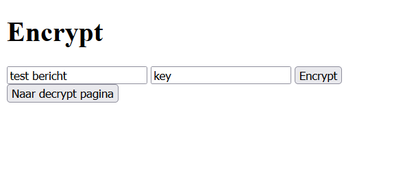
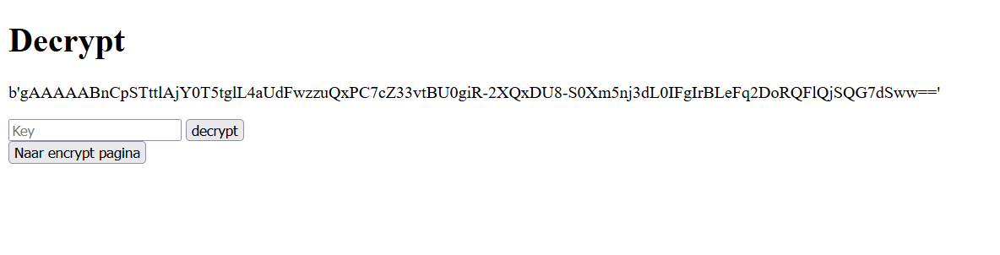
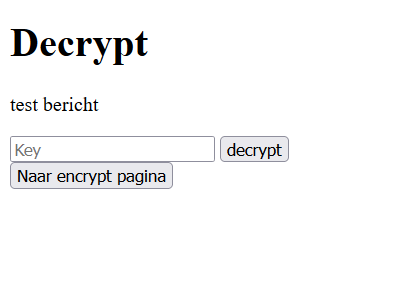

Welke encryptie methode heb ik gebruikt?
Voor dit project heb ik de python library cryptography gebruikt voor symmetriche encryptie. Ook heb ik hashlib gebruikt.
Voor het versleutelen en ontsleutelen hebben gebruikers een key nodig. Deze key moet 32 characters lang zijn. Daarom heb ik hashlib gebruikt. Deze versleuteld de sleutel naar een string van 32 characters.

Hoe werkt het?

Installeer de requirements.txt, en start vervolgens de main.py.
Ga naar http://127.0.0.1:5000
Dit is de encryptie pagina. voer een bericht in, en een key. klik vervolgens op encrypt:

Op de decrypt pagina is het geencrypte bericht te zien:

Als de juiste key is ingevoerd, wordt het bericht zichtbaar:
